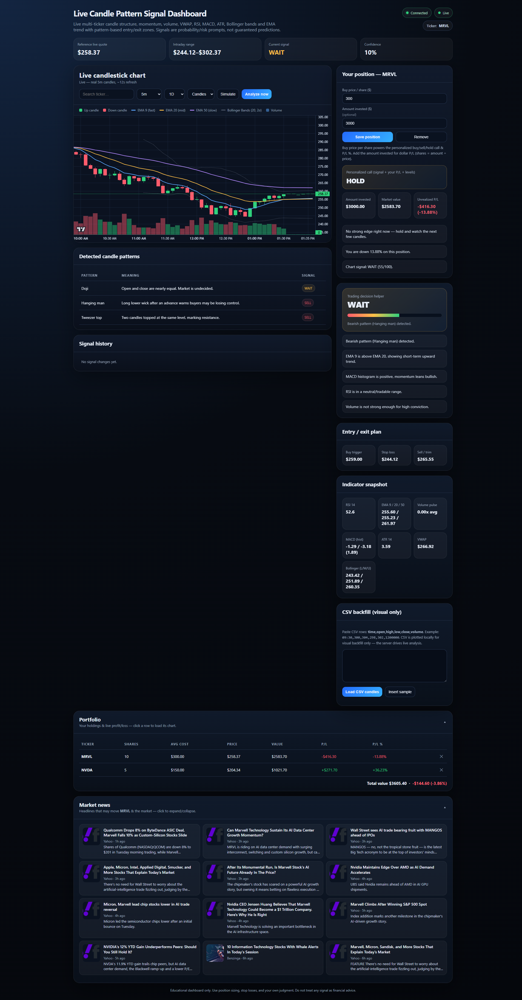

# Live Candle Pattern Signal Dashboard

A live candlestick **pattern-signal dashboard**: pulls **real intraday OHLCV
candles** (Yahoo Finance), runs an **enhanced, explainable rules engine**
(candlestick patterns + technical indicators), and outputs a transparent
**BUY / SELL / WAIT** decision with entry / stop / target levels — streamed to the
browser over WebSocket and auto-refreshed.

> ⚠️ Educational tool only. Signals are probability/risk prompts, **not financial advice**.



## Features

- **Real candles** for any US ticker (type-ahead search) from Yahoo Finance — **no API key required.**
- **Interval** (candle size): 1m / 5m / 15m / 30m / 1h / 1D / 1W, with **live updates** (~12s refresh) on intraday intervals during market hours.
- **Range** (lookback): 1D / 5D / 1M / 3M / 6M / YTD / 1Y / 5Y / Max — auto-clamped to what each interval supports.
- **Candles ↔ Line** chart toggle, with a **color legend** (EMA 9/20/50, Bollinger Bands, volume, up/down candles).
- **Collapsible market-news** section (company + market headlines) that refreshes per ticker.
- **Personalized position tracker:** enter your buy price per share (and optionally amount invested) per ticker — get live P/L and a position-aware call (**HOLD / SELL-trim / BUY-more / TAKE-PROFIT / CUT-LOSS**) that combines the signal, your P/L, and the stop/target levels. Multi-ticker **portfolio** with live totals (saved in your browser).
- Patterns and signals run on **real OHLCV**, not synthetic data, so the analysis is meaningful.
- **Enhanced rules engine** (`engine/`):
  - Indicators: EMA 9/20/50, RSI 14, MACD (12/26/9), Bollinger Bands (20,2), ATR 14, VWAP, volume ratio.
  - ~19 candlestick patterns: doji, hammer / inverted hammer / hanging man, shooting star, bullish/bearish engulfing, harami, piercing / dark cloud, tweezers, morning / evening star, three white soldiers / three black crows, marubozu.
  - Multi-factor weighted score (0–100) → BUY / SELL / WAIT with confidence, human-readable reasons, and ATR-based stop/target levels.
- **Off-hours / no-key fallback:** clearly badged simulated mode so the dashboard is never blank.
- **Signal history log**, indicator snapshot, detected-patterns table, CSV backfill.

## Quick start

```bash
cd candle-signal-dashboard
npm install
npm start                 # http://localhost:3000  (set PORT to change)
```

Works out of the box — **no key needed** (candles come from Yahoo Finance).
Optionally `cp .env.example .env` and add a free [Finnhub](https://finnhub.io/register)
key to enable richer symbol search / quote fallback.

`npm test` runs the engine unit tests (`node --test`).

## How it works

```
Yahoo Finance (real OHLCV) ──► yahoo-client ──► CandleAggregator ──► engine.analyze()
                                                                          │
Browser ◄── /stream WebSocket (snapshot · candle · analysis · status) ─────┘
```

- `src/server.js` — Express static + REST + `ws` server on `/stream`; pulls real candles, runs the engine, pushes updates.
- `src/yahoo-client.js` — **primary** source: real intraday OHLCV from Yahoo Finance (no key).
- `src/finnhub-client.js` / `src/rest-routes.js` — optional symbol search + quote (needs a key).
- `src/candle-aggregator.js` — normalizes/caps the candle series.
- `src/simulator.js` — seeded candle generator, used only as a fallback.
- `src/market-hours.js` — US regular-session (NY time) open/closed detection.
- `engine/` — pure, unit-tested `indicators.js`, `patterns.js`, `scorer.js`, `index.js`.
- `public/` — dashboard UI (TradingView Lightweight Charts).

See `docs/` for the design spec, interface contracts, and implementation plan.

## Data notes

- **Candles are real** intraday OHLCV from Yahoo Finance's public chart API
  (`query1.finance.yahoo.com/v8/finance/chart/...`), refreshed ~every 20s. Off-hours
  it shows the real last session and badges "Market closed."
- If the real fetch ever fails (or you hit **Simulate**), the dashboard falls back to
  a seeded simulator so it's never blank — clearly badged as simulated.
- A Finnhub key is optional and only powers symbol search / quote fallback.

## Deploy on Render

This repo includes a `render.yaml` blueprint. Two ways:

**A. Blueprint (one click):**
1. Push this repo to GitHub (already done if you're reading it there).
2. In Render: **New + → Blueprint**, select the repo. Render reads `render.yaml`
   (Node web service, `npm install` / `npm start`, health check `/api/health`).
3. (Optional) Set `FINNHUB_API_KEY` in the service's **Environment** tab. Deploy.

**B. Manual web service:**
1. Render: **New + → Web Service** → connect the repo.
2. Runtime **Node**, Build `npm install`, Start `npm start`, Plan **Free**.
3. (Optional) add env var `FINNHUB_API_KEY`. Render injects `PORT` automatically —
   the server already reads `process.env.PORT`.
4. Create — you'll get a public `https://<name>.onrender.com` URL.

> Note: Render's free tier sleeps after inactivity (first hit after idle is slow),
> and outbound calls to Yahoo/Finnhub run from Render's servers.

## Timezone

Market-open detection uses **America/New_York** (US Eastern, 09:30–16:00, Mon–Fri,
no holiday calendar). Chart timestamps are stored in UTC but the **x-axis and
crosshair are formatted in the viewer's own local timezone** (via `Intl`), so the
times you see match your machine.

## Roadmap (out of scope for v1)

Multi-timeframe confirmation · outbound alert webhooks (Discord/Slack) · backtesting · optional ML pattern-outcome model.
